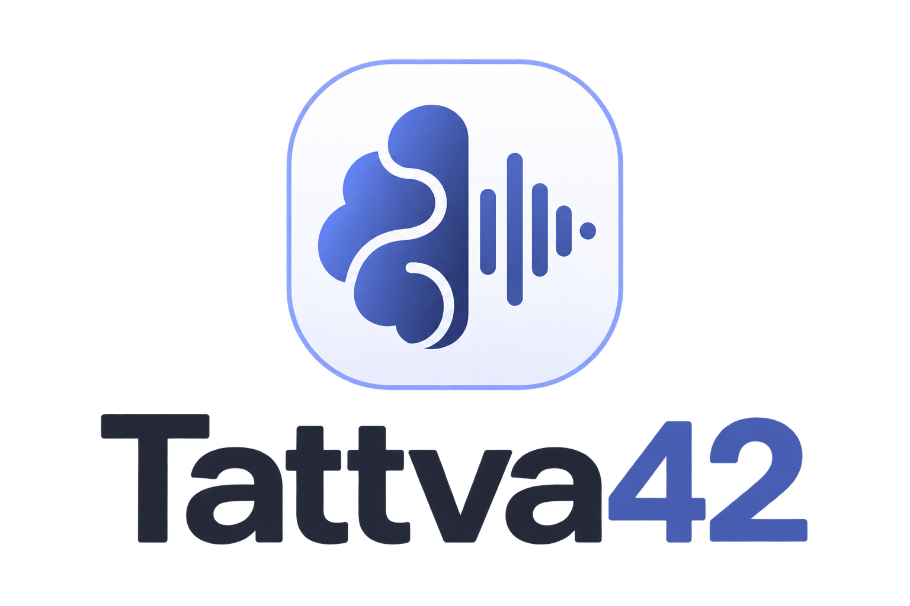
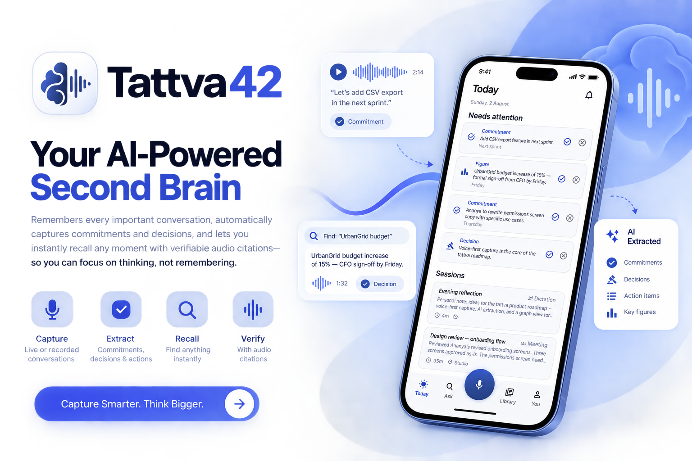
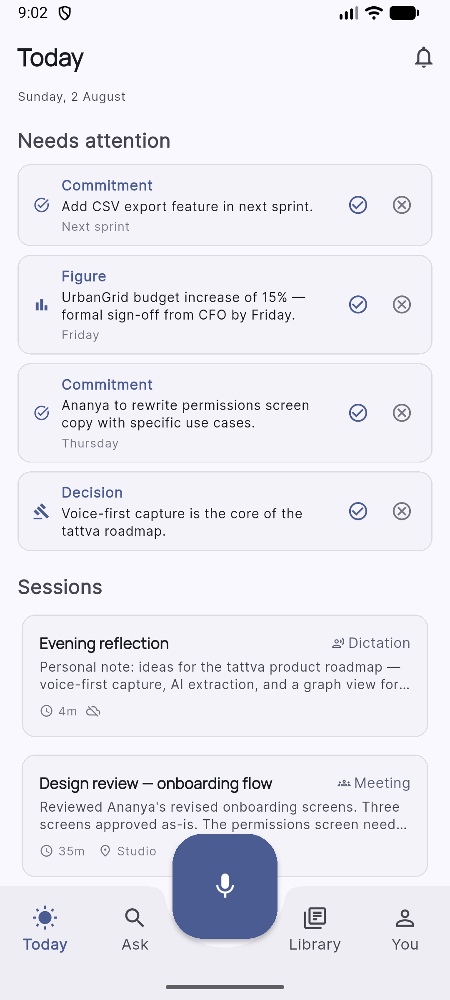
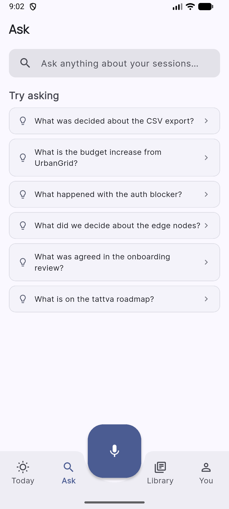
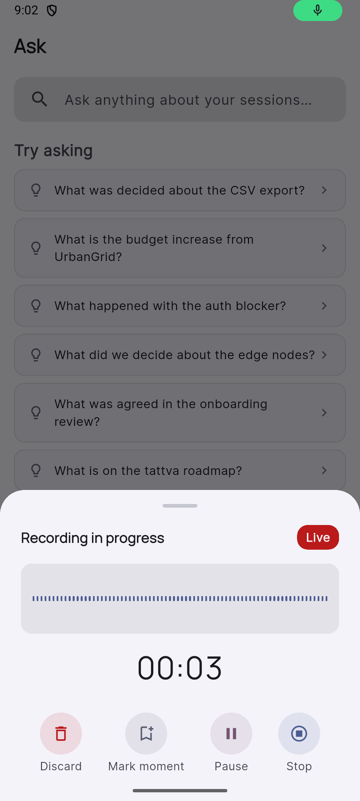
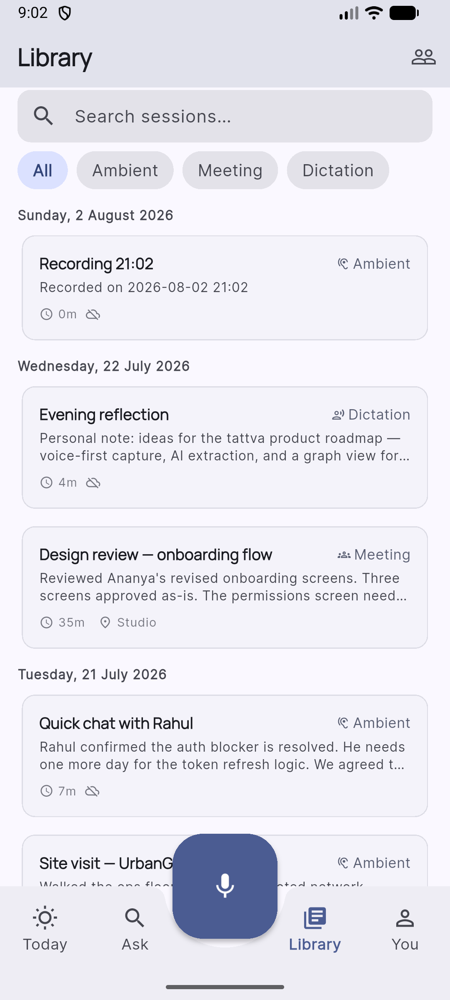

# Tattva42

<p align="center">
  
</p>

Your conversations are full of decisions, commitments, and ideas — Tattva42 makes sure none of them slip through the cracks.

Record a meeting, a quick chat, or a passing thought. Tattva42 transcribes it on-device, surfaces the commitments and decisions automatically, and lets you search across everything in plain language.

<p align="center">
  
</p>

---

## What it does

**Capture** — Record meetings, ambient conversations, or voice dictation from your phone. Audio stays on-device; no cloud upload required.

**Transcribe** — On-device speech recognition turns recordings into full transcripts in real time. No internet needed.

**Extract** — Tattva42 automatically identifies commitments ("I'll send that by Friday"), decisions, and action items buried inside conversations.

**Search** — Ask a question in plain language and get a direct answer with citations — pinpointing exactly which session it came from and where in the recording.

---

## Capture modes

| Mode | Best for |
|---|---|
| **Meeting** | Structured conversations with multiple speakers |
| **Ambient** | Background capture during site visits or casual chats |
| **Dictation** | Solo voice notes and reflections |

---

## Screenshots

<table>
  <tr>
    <td align="center">
      <br/>
      <sub><b>Today</b> — Commitments and decisions needing attention, plus recent sessions</sub>
    </td>
    <td align="center">
      <br/>
      <sub><b>Ask</b> — Search across all sessions in plain language</sub>
    </td>
    <td align="center">
      <br/>
      <sub><b>Capture</b> — Live recording with waveform, markers, and pause/stop</sub>
    </td>
    <td align="center">
      <br/>
      <sub><b>Library</b> — All sessions, filterable by Ambient, Meeting, or Dictation</sub>
    </td>
  </tr>
</table>

---

## Key screens

- **Today** — At-a-glance view of pending commitments, decisions, and recent sessions
- **Ask** — Natural language search across all sessions with cited answers
- **Library** — Full session history, filterable by capture mode
- **You** — Profile, privacy settings, and storage summary

---

## Status

This is a working prototype. The Flutter app runs standalone with mock data — no backend required to try it. The Django backend mirrors the full data model and exposes the same search capability via API for integration work.

---

## Running the app

```bash
cd app
flutter pub get
flutter run          # physical device recommended for microphone access
```

Requires Flutter 3.x / Dart 3. No code generation step needed.

See [`app/README.md`](app/README.md) for permissions setup, seeded sessions, and canned search queries.

## Running the backend

```bash
cd backend
cp .env.example .env
docker compose up --build
docker compose exec web python manage.py migrate
docker compose exec web python manage.py seed_data
```

API at `http://localhost:8000/api/v1/` · Admin at `http://localhost:8000/admin/`

See [`backend/README.md`](backend/README.md) for the full API reference and local setup without Docker.
